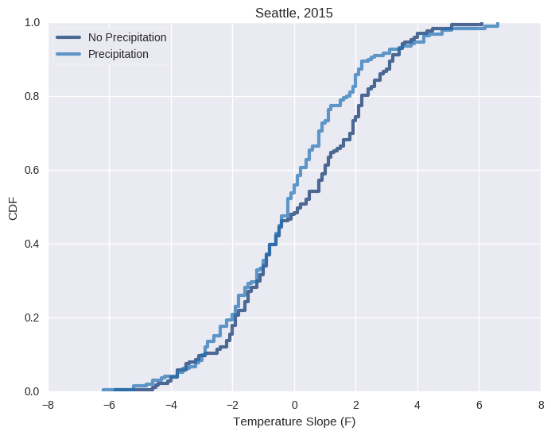
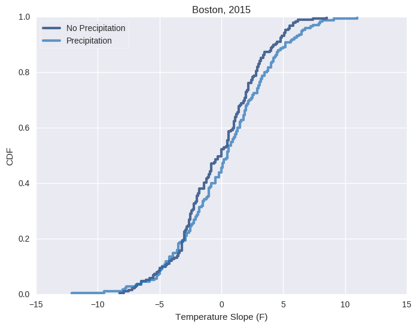

# Does it get warmer before it rains?
#### Apurva Raman and William Lu

Speculating about the weather has been a staple of small talk and human curiosity for a long time, and as a result, many weather "myths" exist. One such myth we’ve heard is that it gets warmer before a precipitation event (e.g. rain, snow, hail, sleet, etc.) occurs.

To see whether or not this conjecture has a basis in fact, we use historical climatological data for multiple cities from the US National Oceanic and Atmospheric Administration (NOAA) to see if there is a correlation between perceptible changes in temperature and precipitation events.

### Defining the Problem

To be able to break down this weather myth, we need to figure out what people mean when they say “it gets warmer.” If the temperature on a given day is higher than the average temperature of the past few days by some perceptible amount, then people would notice that it feels warmer. To quantify this, we compare the average temperature on any given day with the average temperature over the past three days (a three day moving average). We also quantified this by approximating the instantaneous slope on any given day by taking the difference between the day after and the day before and dividing it by two.

In order to look at the temperature change in the run up to a day, we compare the temperature on a the day before a precipitation event with the three day moving average. Another approach we take is to check the slope of temperature the day before a precipitation event.

We then have to define what a precipitation event is. Meteorologists, like us, are also very enthusiastic about detailed data. Even trace amounts of precipitation are recorded. A ‘trace’ is when such a small amount of precipitation falls that it cannot be recorded using a weather instrument (< 0.005 inches water equivalent). However, as human beings, even if only a couple drops of rain fall from the sky, we will still don a raincoat and carry an umbrella. As a result, we still count trace amounts of precipitation as an indication of a precipitation event—it affects people’s perception of the current weather the same way any other precipitation will.

Because weather is highly variable depending on the climate you are in, different cities across the world will have different conditions in which precipitation occurs. Basic meteorological science still applies, but every region has its own microclimate. This is why we compare weather data between different cities across the US.

### Is there an obvious pattern of temperature shifts before a precipitation event?

Using local climatological data from Seattle, WA in 2015, we plot, over time, the temperature deviation from the average temperature of the past three days. Red lines mark days where any precipitation occurred.

This scatterplot allows us to see the range of the values for temperature deviation and how often precipitation events occur. We did this to establish whether we have enough precipitation events in the time scale to look for trends. This representation of the data is not clear enough to establish a relationship between temperature deviation and precipitation events. However, we check if the data points match our expectations about weather patterns. For example, we can tell that there is less precipitation in Seattle during the summer, as is expected.

|  |  |
|:-----------------------------------------:|:-------------------------------------------------:|

Because it is hard to identify relationships in our scatterplot, we graphed the CDF of temperature deviations on days before no precipitation occurred and on days before precipitation occurred. This is the graph on the left. Lower temperatures are on the left of this graph, and higher temperatures are on the right of this graph. A line that is higher on the left side has temperature deviations that are comparatively colder. From this graph, it would appear as if it actually gets slightly colder before there is a precipitation event in Seattle.

We also plotted the CDFs of the temperature slopes on days before no precipitation occurred and on days before precipitation occurred. This is the graph on the right. The relationship between the no precipitation and precipitation CDFs for slopes appears to be similar to that of temperature deviation. 

|  |  |
|:----------------------------------------:|:------------------------------------------------:|

In contrast, temperature deviation and temperature slope data from Boston for 2015 graphed as a CDF shows that it might actually get slightly warmer before a precipitation event. From these results, as well as data from more cities in the US, we can safely assume that any model for predicting precipitation that we create will be location specific.

### Can we predict a precipitation event with temperature shifts?

##### No.

We created a logistical regression model to try to predict whether or not any precipitation would happen on a given day with respect to the temperature deviation. The model returns a fit coefficient for our explanatory variable, temperature deviation, of 0.0188, and an intercept of 0.2748. This tells us that the likelihood of a precipitation event in Seattle in 2015 given a 1 degree temperature deviation is about 57%. The likelihood of precipitation in Seattle in 2015 given no other information is about 52%, which means the model hasn't given us much new information. More importantly, the p-value for this is 0.637, which means that any explanatory effect of temperature deviation is plausibly the product of randomness. The psuedo-R-squared value for this model is about 0.01298, which confirms that this model has little, if any, predictive power.

For other cities and years, the pseudo-R-squared value is consistently low, but the p-value varies much more. This suggests that high p-values may be a result of overfitting, but it is clear that neither the average deviation of the temperature nor the slope has predictive power.

Weather is something that human beings have always tried to predict, and even with supercomputers, we aren’t able to make fully accurate models. Using only temperature, we could not accurately predict precipitation.

Further details of this analysis are [in this Jupyter notebook](https://github.com/williamalu/data_science_weather/blob/master/report2.ipynb).
